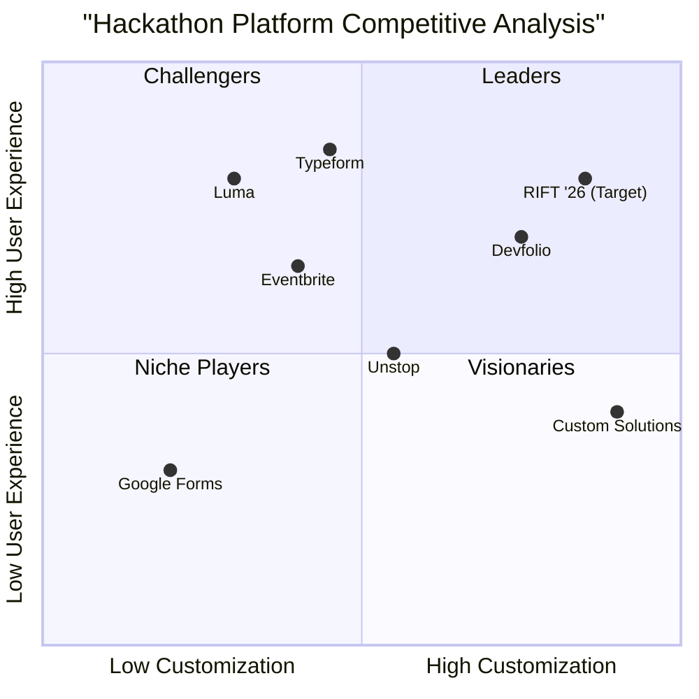
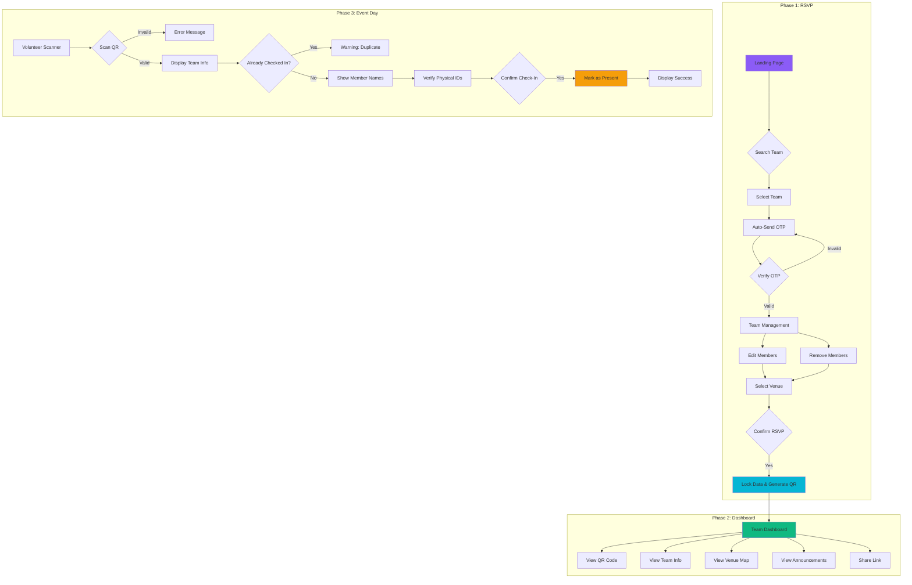

# Product Requirements Document (PRD)

## RIFT '26 Hackathon Management Platform

---

## Document Information

| Field | Value |
|-------|-------|
| **Product Name** | RIFT '26 |
| **Version** | 1.0 |
| **Status** | Draft |
| **Date** | January 31, 2026 |
| **Author** | Product Team |

---

## 1. Overview

### 1.1 Language
English

### 1.2 Programming Language
- **Frontend**: Next.js 14 (App Router) + TypeScript + Tailwind CSS + shadcn/ui
- **Backend**: GoLang (Gin framework)
- **Database**: PostgreSQL
- **Authentication**: JWT + OTP (via Twilio/MSG91)
- **QR Code**: go-qrcode (backend) + react-qr-code (frontend)

### 1.3 Project Name
`rift_26_hackathon_platform`

### 1.4 Original Requirements
Build a centralized web application for RIFT '26 Hackathon to manage the end-to-end lifecycle of hackathon participants. The platform should:

1. Enable shortlisted teams to RSVP through a Typeform-style interface
2. Allow team leaders to search, select, and manage their team members
3. Provide a personalized team dashboard with QR code for event-day check-in
4. Enable registration volunteers to scan QR codes and mark teams as present
5. Display team member details for ID card creation upon successful scan

---

## 2. Product Goals

| # | Goal | Description |
|---|------|-------------|
| 1 | **Streamline RSVP Process** | Replace manual Google Forms with an intuitive, conversational Typeform-style interface that guides shortlisted teams through RSVP confirmation seamlessly |
| 2 | **Enable Dynamic Team Management** | Allow team leaders to edit, update, or remove team members before final submission, ensuring accurate participant data |
| 3 | **Automate Event-Day Check-in** | Utilize QR code technology to eliminate manual attendance tracking, reduce queues, and provide instant access to team member details for ID card creation |

---

## 3. User Stories

| # | User Role | Story | Benefit |
|---|-----------|-------|---------|
| 1 | Team Leader | As a team leader, I want to search for my team by name and verify my identity via OTP, so that I can securely access and manage my team's RSVP |
| 2 | Team Leader | As a team leader, I want to review and edit my team members' details before submitting RSVP, so that all participant information is accurate for the event |
| 3 | Team Leader | As a team leader, I want to receive a unique QR code after RSVP confirmation, so that my team can quickly check-in on the event day |
| 4 | Team Member | As a team member, I want to access my team's dashboard via a shared link, so that I can view our entry pass and event details |
| 5 | Registration Volunteer | As a registration volunteer, I want to scan a team's QR code and see all member names instantly, so that I can efficiently write ID cards and mark attendance |

---

## 4. Competitive Analysis

### 4.1 Competitor Overview

| Product | Type | Pros | Cons |
|---------|------|------|------|
| **Devfolio** | Hackathon Platform | Comprehensive hackathon management, established brand, project submission features | Complex setup, may be overkill for single events, limited customization |
| **Unstop (formerly D2C)** | Competition Platform | Large user base, integrated registration, corporate partnerships | Generic interface, limited team management, no QR check-in |
| **Eventbrite** | Event Management | Easy ticketing, mobile app, analytics | Not hackathon-specific, limited team features, expensive for large events |
| **Luma** | Event Platform | Beautiful UI, simple RSVP, calendar integration | No team management, limited customization, no QR scanning |
| **Typeform** | Form Builder | Excellent UX, conversational forms, integrations | Not event-specific, no dashboard, requires external tools for QR |
| **Google Forms** | Form Builder | Free, familiar, easy to use | Poor UX, no team management, manual data processing |
| **Custom Solutions** | In-house | Full control, tailored features | Development time, maintenance burden, no existing user base |

### 4.2 Competitive Quadrant Chart



---

## 5. Requirements Analysis

### 5.1 Functional Requirements

#### 5.1.1 RSVP Flow (Phase 1)

**Team Search & Verification**
- Users can search for their team by team name
- System displays matching teams from the pre-loaded shortlist database
- Upon team selection, system automatically sends OTP to the registered team leader's phone
- OTP verification grants access to the RSVP form

**Team Member Management**
- Display pre-filled team member details (name, email, phone, role)
- Team leader can edit member information (name, email, phone)
- Team leader can remove members (except themselves)
- Collect additional information (T-shirt size, dietary preferences)

**RSVP Confirmation**
- Team leader selects preferred city/venue from available options
- Upon confirmation, team data is locked and cannot be edited
- System generates unique QR code token for the team
- System generates unique dashboard access token

#### 5.1.2 Team Dashboard (Phase 2)

**Dashboard Features**
- Accessible via unique URL (shareable with team members)
- Display team confirmation status and selected venue
- Show team QR code prominently (entry pass)
- List all team members with their details
- Display venue information with embedded Google Maps
- Show latest announcements from organizers

#### 5.1.3 Event-Day Check-in (Phase 3)

**Volunteer Scanner**
- Dedicated scanner interface for registration volunteers
- Camera access for QR code scanning
- On successful scan: Display team name, member names, T-shirt sizes
- Volunteer verifies physical IDs and clicks "Check-In"
- System marks team as "Checked In" with timestamp
- Prevent duplicate check-ins (show warning if already checked in)

### 5.2 Non-Functional Requirements

| Requirement | Specification |
|-------------|---------------|
| **Performance** | Page load time < 2 seconds, API response time < 500ms |
| **Scalability** | Support 500+ concurrent users during peak RSVP period |
| **Security** | JWT authentication, OTP verification, rate limiting on sensitive endpoints |
| **Availability** | 99.9% uptime during event registration and event day |
| **Mobile Responsiveness** | Fully responsive design for all screen sizes |
| **Browser Support** | Chrome, Firefox, Safari, Edge (latest 2 versions) |

---

## 6. Requirements Pool

| Priority | Requirement | Description | User Story |
|----------|-------------|-------------|------------|
| **P0** | Team Search | Search functionality to find team by name | US-1 |
| **P0** | OTP Verification | Send and verify OTP to team leader's phone | US-1 |
| **P0** | Team Member Display | Show pre-filled team member details | US-2 |
| **P0** | Member Edit/Remove | Allow editing and removing team members | US-2 |
| **P0** | RSVP Submission | Lock team data and generate QR code | US-3 |
| **P0** | Team Dashboard | Display team info, QR code, and venue details | US-3, US-4 |
| **P0** | QR Scanner | Volunteer interface to scan and verify teams | US-5 |
| **P0** | Check-in System | Mark teams as present with member details | US-5 |
| **P1** | City/Venue Selection | Allow selection from multiple venue options | US-2 |
| **P1** | Announcements | Display organizer updates on dashboard | US-4 |
| **P1** | Rate Limiting | Prevent OTP spam (max 3 per hour) | Security |
| **P1** | Duplicate Check-in Prevention | Warn if team already checked in | US-5 |
| **P1** | Dashboard Sharing | Shareable link for team members | US-4 |
| **P2** | Admin CSV Upload | Bulk import shortlisted teams | Admin |
| **P2** | Admin Dashboard | View all teams, export data | Admin |
| **P2** | Support Tickets | Request changes after RSVP lock | US-2 |
| **P2** | Email Notifications | Send confirmation emails after RSVP | US-3 |

---

## 7. UI Design Draft

### 7.1 Page Structure

```
┌─────────────────────────────────────────────────────────────┐
│                     RIFT '26 PLATFORM                        │
├─────────────────────────────────────────────────────────────┤
│                                                              │
│  ┌─────────────────────────────────────────────────────┐    │
│  │                 LANDING PAGE                         │    │
│  │  ┌─────────────────────────────────────────────┐    │    │
│  │  │         🔍 Find Your Team                    │    │    │
│  │  │  [________________________] [Search]         │    │    │
│  │  └─────────────────────────────────────────────┘    │    │
│  │                                                      │    │
│  │  Search Results:                                     │    │
│  │  ┌─────────────────────────────────────────────┐    │    │
│  │  │ Team Alpha                              [→] │    │    │
│  │  │ Team Beta                               [→] │    │    │
│  │  │ Team Gamma                              [→] │    │    │
│  │  └─────────────────────────────────────────────┘    │    │
│  └─────────────────────────────────────────────────────┘    │
│                                                              │
├─────────────────────────────────────────────────────────────┤
│                                                              │
│  ┌─────────────────────────────────────────────────────┐    │
│  │               OTP VERIFICATION                       │    │
│  │                                                      │    │
│  │              🔐 Verify Identity                      │    │
│  │                                                      │    │
│  │     OTP sent to ******8901                          │    │
│  │                                                      │    │
│  │     [ ] [ ] [ ] [ ] [ ] [ ]                         │    │
│  │                                                      │    │
│  │           [Verify OTP]                              │    │
│  │                                                      │    │
│  │     Didn't receive? Resend in 30s                   │    │
│  └─────────────────────────────────────────────────────┘    │
│                                                              │
├─────────────────────────────────────────────────────────────┤
│                                                              │
│  ┌─────────────────────────────────────────────────────┐    │
│  │              TEAM MEMBER MANAGEMENT                  │    │
│  │                                                      │    │
│  │  ┌─────────────────────────────────────────────┐    │    │
│  │  │ 👤 John Doe (Leader)              [Edit]    │    │    │
│  │  │    john@email.com | +91-9876543210          │    │    │
│  │  │    T-Shirt: [M ▼]                           │    │    │
│  │  └─────────────────────────────────────────────┘    │    │
│  │                                                      │    │
│  │  ┌─────────────────────────────────────────────┐    │    │
│  │  │ 👤 Jane Smith (Member)     [Edit] [Remove]  │    │    │
│  │  │    jane@email.com | +91-9876543211          │    │    │
│  │  │    T-Shirt: [S ▼]                           │    │    │
│  │  └─────────────────────────────────────────────┘    │    │
│  │                                                      │    │
│  │  Venue: [Bangalore ▼]                               │    │
│  │                                                      │    │
│  │           [Confirm RSVP]                            │    │
│  └─────────────────────────────────────────────────────┘    │
│                                                              │
├─────────────────────────────────────────────────────────────┤
│                                                              │
│  ┌─────────────────────────────────────────────────────┐    │
│  │                 TEAM DASHBOARD                       │    │
│  │                                                      │    │
│  │  ┌─────────────────────────────────────────────┐    │    │
│  │  │     ✅ Confirmed for Bangalore Venue         │    │    │
│  │  └─────────────────────────────────────────────┘    │    │
│  │                                                      │    │
│  │  ┌─────────────────────────────────────────────┐    │    │
│  │  │              ENTRY PASS                      │    │    │
│  │  │         ┌─────────────┐                      │    │    │
│  │  │         │ ▓▓▓▓▓▓▓▓▓▓▓ │                      │    │    │
│  │  │         │ ▓▓ QR ▓▓▓▓ │                      │    │    │
│  │  │         │ ▓▓ CODE ▓▓ │                      │    │    │
│  │  │         │ ▓▓▓▓▓▓▓▓▓▓▓ │                      │    │    │
│  │  │         └─────────────┘                      │    │    │
│  │  │         Team Alpha                           │    │    │
│  │  └─────────────────────────────────────────────┘    │    │
│  │                                                      │    │
│  │  Team Members:                                       │    │
│  │  • John Doe (Leader) - M                            │    │
│  │  • Jane Smith - S                                   │    │
│  │                                                      │    │
│  │  📍 Venue Map [Embedded Google Map]                 │    │
│  │                                                      │    │
│  │  📢 Announcements                                   │    │
│  │  • Event starts at 9 AM sharp!                      │    │
│  └─────────────────────────────────────────────────────┘    │
│                                                              │
├─────────────────────────────────────────────────────────────┤
│                                                              │
│  ┌─────────────────────────────────────────────────────┐    │
│  │              VOLUNTEER SCANNER                       │    │
│  │                                                      │    │
│  │  ┌─────────────────────────────────────────────┐    │    │
│  │  │                                             │    │    │
│  │  │           📷 CAMERA VIEW                    │    │    │
│  │  │                                             │    │    │
│  │  │         Point at QR Code                    │    │    │
│  │  │                                             │    │    │
│  │  └─────────────────────────────────────────────┘    │    │
│  │                                                      │    │
│  │  ─────────── SCAN RESULT ───────────                │    │
│  │                                                      │    │
│  │  Team: Team Alpha                                   │    │
│  │  Status: ✅ Ready for Check-in                      │    │
│  │                                                      │    │
│  │  Members to write on ID Cards:                      │    │
│  │  1. John Doe - Size M                               │    │
│  │  2. Jane Smith - Size S                             │    │
│  │                                                      │    │
│  │           [✓ Confirm Check-In]                      │    │
│  └─────────────────────────────────────────────────────┘    │
│                                                              │
└─────────────────────────────────────────────────────────────┘
```

### 7.2 User Flow Diagram



---

## 8. Open Questions

| # | Question | Context | Impact |
|---|----------|---------|--------|
| 1 | What is the maximum team size allowed? | Need to validate member count during RSVP | Database schema, UI layout |
| 2 | Should we support multiple venues/cities? | PRD mentions BLR, PUNE, NOIDA, LKO | Venue selection UI, database |
| 3 | What happens if a team leader's phone number is incorrect in the CSV? | OTP cannot be delivered | Need fallback mechanism or admin override |
| 4 | Should team members be able to edit their own details? | Currently only leader can edit | Permission system complexity |
| 5 | What is the deadline for RSVP submissions? | Need to disable RSVP after deadline | Time-based feature toggle |
| 6 | Should we support partial check-ins (some members present)? | Currently checking in entire team | Check-in logic modification |
| 7 | What information should be displayed on the physical ID cards? | Volunteer needs to know what to write | Scanner display requirements |
| 8 | Is there a need for email notifications in addition to SMS OTP? | Backup communication channel | Integration with email service |

---

## 9. Technical Architecture

### 9.1 System Architecture

```
┌─────────────────────────────────────────────────────────────┐
│                        FRONTEND                              │
│                   (Next.js 14 + TypeScript)                  │
│  ┌─────────┐  ┌─────────┐  ┌─────────┐  ┌─────────┐        │
│  │ Landing │  │  RSVP   │  │Dashboard│  │ Scanner │        │
│  │  Page   │  │  Flow   │  │  Page   │  │  Page   │        │
│  └────┬────┘  └────┬────┘  └────┬────┘  └────┬────┘        │
│       │            │            │            │              │
│       └────────────┴────────────┴────────────┘              │
│                         │                                    │
│                    [API Client]                              │
└─────────────────────────┬───────────────────────────────────┘
                          │ HTTPS
                          ▼
┌─────────────────────────────────────────────────────────────┐
│                        BACKEND                               │
│                    (GoLang + Gin)                            │
│  ┌─────────────────────────────────────────────────────┐    │
│  │                   API Gateway                        │    │
│  │  • Authentication Middleware (JWT)                   │    │
│  │  • Rate Limiting                                     │    │
│  │  • CORS                                              │    │
│  └─────────────────────────────────────────────────────┘    │
│                          │                                   │
│  ┌──────────┐  ┌──────────┐  ┌──────────┐  ┌──────────┐    │
│  │  Team    │  │   Auth   │  │  Admin   │  │ Volunteer│    │
│  │ Handler  │  │ Handler  │  │ Handler  │  │ Handler  │    │
│  └────┬─────┘  └────┬─────┘  └────┬─────┘  └────┬─────┘    │
│       │             │             │             │           │
│  ┌──────────────────────────────────────────────────────┐   │
│  │                  Service Layer                        │   │
│  │  • TeamService  • AuthService  • QRCodeService       │   │
│  └──────────────────────────────────────────────────────┘   │
│                          │                                   │
│  ┌──────────────────────────────────────────────────────┐   │
│  │                 Repository Layer                      │   │
│  │  • TeamRepository  • OTPRepository  • UserRepository │   │
│  └──────────────────────────────────────────────────────┘   │
└─────────────────────────┬───────────────────────────────────┘
                          │
                          ▼
┌─────────────────────────────────────────────────────────────┐
│                      DATABASE                                │
│                    (PostgreSQL)                              │
│  ┌─────────┐  ┌─────────┐  ┌─────────┐  ┌─────────┐        │
│  │  teams  │  │ members │  │   otps  │  │  users  │        │
│  └─────────┘  └─────────┘  └─────────┘  └─────────┘        │
└─────────────────────────────────────────────────────────────┘
                          │
                          ▼
┌─────────────────────────────────────────────────────────────┐
│                  EXTERNAL SERVICES                           │
│  ┌─────────────┐  ┌─────────────┐                           │
│  │ Twilio/MSG91│  │ Google Maps │                           │
│  │  (SMS OTP)  │  │   (Embed)   │                           │
│  └─────────────┘  └─────────────┘                           │
└─────────────────────────────────────────────────────────────┘
```

### 9.2 Database Schema Overview

```
┌──────────────────┐       ┌──────────────────┐
│      teams       │       │   team_members   │
├──────────────────┤       ├──────────────────┤
│ id (PK)          │───┐   │ id (PK)          │
│ team_name        │   │   │ team_id (FK)     │──┐
│ city             │   └──▶│ name             │  │
│ status           │       │ email            │  │
│ qr_code_token    │       │ phone            │  │
│ dashboard_token  │       │ role             │  │
│ rsvp_locked      │       │ tshirt_size      │  │
│ checked_in_at    │       └──────────────────┘  │
└──────────────────┘                             │
         │                                       │
         │         ┌──────────────────┐          │
         │         │       otps       │          │
         │         ├──────────────────┤          │
         └────────▶│ id (PK)          │          │
                   │ phone            │          │
                   │ otp_code         │          │
                   │ team_id (FK)     │◀─────────┘
                   │ expires_at       │
                   │ verified         │
                   └──────────────────┘
```

---

## 10. Success Metrics

| Metric | Target | Measurement |
|--------|--------|-------------|
| RSVP Completion Rate | > 90% of shortlisted teams | Confirmed RSVPs / Total Shortlisted |
| Average RSVP Time | < 3 minutes | Time from landing to confirmation |
| Check-in Speed | < 30 seconds per team | Time from scan to check-in complete |
| System Uptime | 99.9% | Monitoring during event period |
| User Satisfaction | > 4.5/5 | Post-event survey |

---

## 11. Timeline

| Phase | Duration | Deliverables |
|-------|----------|--------------|
| **Phase 1: Setup** | 2 days | Project scaffolding, database setup, authentication |
| **Phase 2: RSVP Flow** | 4 days | Team search, OTP, member management, confirmation |
| **Phase 3: Dashboard** | 3 days | Team dashboard, QR code display, venue info |
| **Phase 4: Scanner** | 2 days | Volunteer scanner, check-in system |
| **Phase 5: Testing** | 2 days | Integration testing, UAT |
| **Phase 6: Deployment** | 1 day | Production deployment, monitoring setup |

**Total Estimated Duration: 14 days**

---

## 12. Appendix

### 12.1 Glossary

| Term | Definition |
|------|------------|
| **RSVP** | Répondez s'il vous plaît - Confirmation of attendance |
| **OTP** | One-Time Password for verification |
| **QR Code** | Quick Response code for scanning |
| **Team Leader** | Primary contact person for the team |
| **Dashboard Token** | Unique identifier for accessing team dashboard |

### 12.2 References

- [Next.js 14 Documentation](https://nextjs.org/docs)
- [Gin Web Framework](https://gin-gonic.com/docs/)
- [shadcn/ui Components](https://ui.shadcn.com/)
- [PostgreSQL Documentation](https://www.postgresql.org/docs/)

---

*Document End*