# RIFT '26 Hackathon Management Platform - User Flow Diagrams

## Table of Contents
1. [System Overview](#1-system-overview)
2. [Participant (Team Leader) Flow](#2-participant-team-leader-flow)
3. [Participant (Member) Flow](#3-participant-member-flow)
4. [Volunteer Flow](#4-volunteer-flow)
5. [Admin Flow](#5-admin-flow)
6. [Phase-wise Detailed Flows](#6-phase-wise-detailed-flows)

---

## 1. System Overview

```mermaid
flowchart TB
    subgraph Users["👥 User Roles"]
        TL["🎯 Team Leader"]
        TM["👤 Team Member"]
        VOL["📱 Volunteer"]
        ADMIN["⚙️ Admin"]
    end

    subgraph Phases["📅 Event Phases"]
        P1["Phase 1: RSVP & Team Confirmation"]
        P2["Phase 2: Team Dashboard"]
        P3["Phase 3: Event Day Onboarding"]
        P4["Phase 4: Hackathon Execution"]
    end

    subgraph System["🖥️ RIFT '26 Platform"]
        AUTH["Authentication Service"]
        TEAM["Team Management"]
        QR["QR Code System"]
        DASH["Dashboard"]
        SUB["Submission Portal"]
    end

    TL --> P1
    TL --> P2
    TL --> P4
    TM --> P2
    TM --> P3
    VOL --> P3
    ADMIN --> P1
    ADMIN --> P2
    ADMIN --> P3
    ADMIN --> P4

    P1 --> AUTH
    P1 --> TEAM
    P2 --> DASH
    P2 --> QR
    P3 --> QR
    P4 --> SUB

    style TL fill:#4CAF50,color:#fff
    style TM fill:#2196F3,color:#fff
    style VOL fill:#FF9800,color:#fff
    style ADMIN fill:#9C27B0,color:#fff
    style P1 fill:#E3F2FD
    style P2 fill:#E8F5E9
    style P3 fill:#FFF3E0
    style P4 fill:#FCE4EC
```

---

## 2. Participant (Team Leader) Flow

```mermaid
flowchart TD
    START((🚀 Start)) --> LAND[Landing Page]
    LAND --> SEARCH[/"Enter Team Name"/]
    SEARCH --> LOOKUP{Team Found?}
    
    LOOKUP -->|No| ERROR1[/"❌ Team Not Found<br/>Check spelling or contact support"/]
    ERROR1 --> SEARCH
    
    LOOKUP -->|Yes| DISPLAY["Display Team Info<br/>(Last 4 digits of phone shown)"]
    DISPLAY --> TRIGGER["🔐 Auto-trigger OTP<br/>to Leader's Phone"]
    TRIGGER --> OTP_INPUT[/"Enter 6-digit OTP"/]
    
    OTP_INPUT --> VERIFY{OTP Valid?}
    VERIFY -->|No| RETRY{Retries Left?}
    RETRY -->|Yes| OTP_INPUT
    RETRY -->|No| BLOCKED["⛔ Account Temporarily Blocked<br/>(Rate Limited)"]
    BLOCKED --> SUPPORT["Contact Support"]
    
    VERIFY -->|Yes| RSVP_FORM["📝 RSVP Form Loaded"]
    
    subgraph TEAM_MGMT["Team Member Management"]
        RSVP_FORM --> VIEW_MEMBERS["View Pre-filled Members"]
        VIEW_MEMBERS --> EDIT_CHOICE{Edit Members?}
        EDIT_CHOICE -->|Yes| EDIT_MEMBER["✏️ Edit Member Details"]
        EDIT_CHOICE -->|No| CITY_SELECT
        EDIT_MEMBER --> REMOVE_CHOICE{Remove Member?}
        REMOVE_CHOICE -->|Yes| REMOVE["🗑️ Remove Member"]
        REMOVE_CHOICE -->|No| CITY_SELECT
        REMOVE --> CITY_SELECT
    end
    
    CITY_SELECT[/"🏙️ Select City Venue<br/>(BLR/PUNE/NOIDA/LKO)"/]
    CITY_SELECT --> REVIEW["Review All Details"]
    REVIEW --> CONFIRM{Confirm RSVP?}
    CONFIRM -->|No| VIEW_MEMBERS
    CONFIRM -->|Yes| SUBMIT["✅ Submit RSVP"]
    
    SUBMIT --> LOCK["🔒 TEAM LOCKED<br/>(No further edits)"]
    LOCK --> CONFETTI["🎉 Success Animation"]
    CONFETTI --> DASHBOARD["📊 Redirect to Dashboard"]
    
    DASHBOARD --> PS_UNLOCK{PS Selection<br/>Unlocked?}
    PS_UNLOCK -->|No| WAIT["⏳ Wait for Event Start<br/>(Feb 19, 12:30 PM)"]
    PS_UNLOCK -->|Yes| SELECT_PS[/"Select Problem Statement"/]
    SELECT_PS --> PS_LOCK["🔒 Track Locked"]
    
    PS_LOCK --> CODE_FREEZE{Code Freeze?}
    CODE_FREEZE -->|No| HACK["💻 Continue Hacking"]
    HACK --> CODE_FREEZE
    CODE_FREEZE -->|Yes| SUBMIT_PROJECT[/"📤 Submit Project<br/>GitHub | Hosted | PPT | Video"/]
    SUBMIT_PROJECT --> DONE((✅ Complete))

    style START fill:#4CAF50,color:#fff
    style DONE fill:#4CAF50,color:#fff
    style LOCK fill:#f44336,color:#fff
    style PS_LOCK fill:#f44336,color:#fff
    style BLOCKED fill:#f44336,color:#fff
    style CONFETTI fill:#FFD700,color:#000
    style DASHBOARD fill:#2196F3,color:#fff
```

---

## 3. Participant (Member) Flow

```mermaid
flowchart TD
    START((🚀 Start)) --> ACCESS{How to Access?}
    
    ACCESS -->|Shared Link| LINK["📧 Click Shared Link<br/>from Team Leader"]
    ACCESS -->|Direct Login| LOGIN[/"Enter Email/Phone"/]
    
    LOGIN --> OTP_SEND["📱 Send OTP"]
    OTP_SEND --> OTP_VERIFY[/"Enter OTP"/]
    OTP_VERIFY --> VALID{Valid?}
    VALID -->|No| OTP_VERIFY
    VALID -->|Yes| DASH
    
    LINK --> DASH["📊 Team Dashboard"]
    
    subgraph DASHBOARD["Dashboard Features"]
        DASH --> STATUS["🏷️ View Status Banner<br/>'Confirmed for [City]'"]
        DASH --> QR["📱 View Personal QR Code<br/>(Entry Pass)"]
        DASH --> MAP["🗺️ View Venue Map"]
        DASH --> ANNOUNCE["📢 View Announcements"]
        DASH --> TEAM_INFO["👥 View Team Info"]
    end
    
    QR --> DOWNLOAD["⬇️ Download QR Code"]
    DOWNLOAD --> SAVE["💾 Save to Phone"]
    
    ANNOUNCE --> NEW{New Updates?}
    NEW -->|Yes| READ["📖 Read Update"]
    NEW -->|No| REFRESH["🔄 Refresh Later"]
    
    SAVE --> EVENT_DAY((📅 Event Day))
    EVENT_DAY --> SHOW_QR["📱 Show QR at Entry"]
    SHOW_QR --> CHECKED_IN["✅ Checked In"]

    style START fill:#2196F3,color:#fff
    style EVENT_DAY fill:#FF9800,color:#fff
    style CHECKED_IN fill:#4CAF50,color:#fff
    style QR fill:#9C27B0,color:#fff
```

---

## 4. Volunteer Flow

```mermaid
flowchart TD
    START((🚀 Start)) --> LOGIN[/"Volunteer Login<br/>(Restricted Access)"/]
    LOGIN --> AUTH{Authorized?}
    AUTH -->|No| DENIED["⛔ Access Denied"]
    AUTH -->|Yes| SCANNER["📷 Scanner Mode Activated"]
    
    SCANNER --> CAMERA["📸 Camera Access Requested"]
    CAMERA --> READY["✅ Ready to Scan"]
    
    READY --> SCAN[/"🔍 Scan Participant QR"/]
    SCAN --> FETCH["⏳ Fetching Team Data..."]
    FETCH --> FOUND{Team Found?}
    
    FOUND -->|No| INVALID["❌ Invalid QR Code"]
    INVALID --> SCAN
    
    FOUND -->|Yes| DISPLAY_INFO["📋 Display Team Info"]
    
    subgraph INFO_DISPLAY["Team Information Display"]
        DISPLAY_INFO --> TEAM_NAME["🏷️ Team Name"]
        DISPLAY_INFO --> MEMBERS["👥 Member Names"]
        DISPLAY_INFO --> TSHIRT["👕 T-Shirt Sizes"]
        DISPLAY_INFO --> STATUS["📊 Current Status"]
    end
    
    STATUS --> CHECK_STATUS{Already<br/>Checked In?}
    CHECK_STATUS -->|Yes| WARNING["⚠️ WARNING:<br/>Already Checked In!<br/>Timestamp: [TIME]"]
    WARNING --> OVERRIDE{Override?}
    OVERRIDE -->|No| SCAN
    OVERRIDE -->|Yes| VERIFY_ID
    
    CHECK_STATUS -->|No| VERIFY_ID["🪪 Verify Physical ID"]
    VERIFY_ID --> ID_MATCH{ID Matches?}
    ID_MATCH -->|No| REJECT["❌ ID Mismatch<br/>Escalate to Admin"]
    ID_MATCH -->|Yes| CHECKIN["✅ Click 'Check-In'"]
    
    CHECKIN --> UPDATE["💾 Update Status:<br/>'Checked_In'<br/>Timestamp Recorded"]
    UPDATE --> WRITE_CARD["✍️ Write on ID Card:<br/>Team Name, Member Name"]
    WRITE_CARD --> NEXT["➡️ Next Participant"]
    NEXT --> SCAN

    style START fill:#FF9800,color:#fff
    style SCANNER fill:#2196F3,color:#fff
    style CHECKIN fill:#4CAF50,color:#fff
    style WARNING fill:#f44336,color:#fff
    style REJECT fill:#f44336,color:#fff
    style DENIED fill:#f44336,color:#fff
```

---

## 5. Admin Flow

```mermaid
flowchart TD
    START((🚀 Start)) --> LOGIN[/"Admin Login<br/>(Secure Auth)"/]
    LOGIN --> ADMIN_DASH["🎛️ Admin Dashboard"]
    
    subgraph PRE_EVENT["Pre-Event Tasks"]
        ADMIN_DASH --> UPLOAD["📤 Upload Master CSV"]
        UPLOAD --> PARSE["⚙️ Parse & Validate CSV"]
        PARSE --> VALID{Valid Format?}
        VALID -->|No| ERROR["❌ Show Errors<br/>Fix & Re-upload"]
        ERROR --> UPLOAD
        VALID -->|Yes| IMPORT["✅ Import to Database"]
        IMPORT --> POPULATE["📊 Teams Collection Populated"]
    end
    
    subgraph DATA_MGMT["Data Management"]
        ADMIN_DASH --> VIEW_ALL["👁️ View All Teams"]
        VIEW_ALL --> FILTER[/"Filter by:<br/>City | Status | Search"/]
        FILTER --> TEAM_LIST["📋 Team List"]
        TEAM_LIST --> SELECT_TEAM["Select Team"]
        SELECT_TEAM --> TEAM_DETAIL["📄 Team Details"]
        
        TEAM_DETAIL --> EDIT_TEAM["✏️ Edit Team<br/>(Override Lock)"]
        TEAM_DETAIL --> EXPORT["📥 Export Data"]
    end
    
    subgraph ANNOUNCEMENTS["Announcement Management"]
        ADMIN_DASH --> ANNOUNCE["📢 Manage Announcements"]
        ANNOUNCE --> CREATE[/"Create New Announcement"/]
        CREATE --> TARGET["🎯 Select Target:<br/>All | City | Team"]
        TARGET --> PUBLISH["📤 Publish"]
        PUBLISH --> NOTIFY["🔔 Push to Dashboards"]
    end
    
    subgraph SUPPORT["Support Tickets"]
        ADMIN_DASH --> TICKETS["🎫 View Support Tickets"]
        TICKETS --> OPEN_TICKET["📬 Open Tickets"]
        OPEN_TICKET --> REVIEW_REQ["Review Request"]
        REVIEW_REQ --> ACTION{Action?}
        ACTION -->|Approve Edit| UNLOCK["🔓 Unlock Team<br/>for Editing"]
        ACTION -->|Reject| CLOSE["❌ Close Ticket"]
        ACTION -->|Need Info| RESPOND["💬 Respond to User"]
        UNLOCK --> RE_LOCK["🔒 Re-lock After Edit"]
    end
    
    subgraph ANALYTICS["Event Day Analytics"]
        ADMIN_DASH --> LIVE_STATS["📊 Live Statistics"]
        LIVE_STATS --> CHECKIN_COUNT["✅ Check-in Count"]
        LIVE_STATS --> CITY_BREAKDOWN["🏙️ City-wise Breakdown"]
        LIVE_STATS --> PS_STATS["📈 PS Selection Stats"]
        LIVE_STATS --> SUB_STATS["📤 Submission Stats"]
    end

    style START fill:#9C27B0,color:#fff
    style ADMIN_DASH fill:#9C27B0,color:#fff
    style IMPORT fill:#4CAF50,color:#fff
    style PUBLISH fill:#4CAF50,color:#fff
    style UNLOCK fill:#FF9800,color:#fff
```

---

## 6. Phase-wise Detailed Flows

### 6.1 Phase 1: RSVP & Team Confirmation

```mermaid
sequenceDiagram
    autonumber
    participant TL as 🎯 Team Leader
    participant UI as 🖥️ Frontend
    participant API as ⚙️ Backend API
    participant DB as 🗄️ PostgreSQL
    participant SMS as 📱 SMS Service

    Note over TL,SMS: Phase 1: RSVP Process

    TL->>UI: Enter Team Name
    UI->>API: GET /api/teams/search?name={teamName}
    API->>DB: Query teams WHERE name LIKE '%{teamName}%'
    DB-->>API: Return matching teams
    API-->>UI: Team data (masked phone: ******8901)
    UI-->>TL: Display team info

    TL->>UI: Click "Verify"
    UI->>API: POST /api/auth/send-otp
    API->>DB: Get leader phone number
    API->>SMS: Send OTP to phone
    SMS-->>TL: 📱 OTP Received
    API->>DB: Store OTP (expires in 5 min)
    API-->>UI: OTP sent confirmation

    TL->>UI: Enter OTP
    UI->>API: POST /api/auth/verify-otp
    API->>DB: Validate OTP
    alt OTP Valid
        DB-->>API: OTP verified
        API->>DB: Generate session token
        API-->>UI: Auth token + Team data
        UI-->>TL: Show RSVP Form
    else OTP Invalid
        API-->>UI: Error: Invalid OTP
        UI-->>TL: Retry prompt
    end

    Note over TL,UI: Team Member Management

    TL->>UI: Edit member details
    TL->>UI: Remove member (optional)
    TL->>UI: Select city venue
    TL->>UI: Click "Confirm RSVP"

    UI->>API: PUT /api/teams/{teamId}/rsvp
    API->>DB: Update team (status='RSVP_Done', locked=true)
    API->>DB: Update members
    DB-->>API: Success
    API-->>UI: RSVP confirmed
    UI-->>TL: 🎉 Success + Redirect to Dashboard
```

### 6.2 Phase 2: Dashboard Access

### 6.3 Phase 3: Event Day Check-in

### 6.4 Phase 4: Hackathon Execution

```mermaid
sequenceDiagram
    autonumber
    participant TL as 🎯 Team Leader
    participant UI as 🖥️ Dashboard
    participant API as ⚙️ Backend API
    participant DB as 🗄️ PostgreSQL
    participant TIME as ⏰ Scheduler

    Note over TL,TIME: Problem Statement Selection (12:30 PM)

    TIME->>API: Trigger: Unlock PS Selection
    API->>DB: UPDATE config SET ps_unlocked=true
    
    TL->>UI: Refresh Dashboard
    UI->>API: GET /api/dashboard/{teamId}
    API-->>UI: PS Selection now available
    UI-->>TL: 🔓 PS Selection Module Visible

    TL->>UI: View Problem Statements
    UI->>API: GET /api/problem-statements
    API->>DB: Fetch all PS
    DB-->>API: PS list with tracks
    API-->>UI: Problem statements
    UI-->>TL: Display PS options

    TL->>UI: Select Problem Statement
    UI->>API: POST /api/teams/{teamId}/select-ps
    API->>DB: UPDATE team SET problem_statement={psId}
    DB-->>API: Success
    API-->>UI: 🔒 Track locked
    UI-->>TL: "You've selected: {PS Title}"

    Note over TL,TIME: Project Submission (Code Freeze)

    TIME->>API: Trigger: Enable Submissions
    API->>DB: UPDATE config SET submissions_open=true

    TL->>UI: Refresh Dashboard
    UI-->>TL: 📤 Submit Project button visible

    TL->>UI: Click "Submit Project"
    UI-->>TL: Submission Form

    TL->>UI: Fill submission details
    Note right of TL: GitHub Repo, Hosted Link,<br/>Presentation, Demo Video

    TL->>UI: Click "Submit"
    UI->>API: POST /api/submissions
    API->>DB: INSERT submission record
    DB-->>API: Success
    API-->>UI: ✅ Submission received
    UI-->>TL: 🎉 "Project submitted successfully!"

    Note over UI: Submission is timestamped<br/>Late submissions flagged
```

---

## 7. State Transition Diagram

---

## 8. Error Handling Flow

```mermaid
flowchart TD
    subgraph ERRORS["Common Error Scenarios"]
        E1["❌ Team Not Found"]
        E2["❌ Invalid OTP"]
        E3["❌ Rate Limited"]
        E4["❌ Already Checked In"]
        E5["❌ Submission Deadline Passed"]
        E6["❌ Invalid QR Code"]
    end

    E1 --> R1["💡 Check spelling<br/>Contact support if issue persists"]
    E2 --> R2["💡 Request new OTP<br/>Check phone number"]
    E3 --> R3["💡 Wait 15 minutes<br/>Too many attempts"]
    E4 --> R4["💡 Show timestamp<br/>Volunteer decides action"]
    E5 --> R5["💡 Contact admin<br/>Late submission flagged"]
    E6 --> R6["💡 Re-scan<br/>Check QR quality"]

    subgraph SUPPORT["Support Escalation"]
        R1 --> TICKET["🎫 Create Support Ticket"]
        R3 --> TICKET
        R5 --> TICKET
        TICKET --> ADMIN["👨‍💼 Admin Reviews"]
        ADMIN --> RESOLVE["✅ Issue Resolved"]
    end

    style E1 fill:#ffcdd2
    style E2 fill:#ffcdd2
    style E3 fill:#ffcdd2
    style E4 fill:#ffcdd2
    style E5 fill:#ffcdd2
    style E6 fill:#ffcdd2
    style RESOLVE fill:#c8e6c9
```

---

## 9. Complete System Flow Overview

---

## 10. Data Flow Architecture

```mermaid
flowchart LR
    subgraph CLIENT["🖥️ Frontend (Next.js)"]
        LAND["Landing Page"]
        RSVP_UI["RSVP Form"]
        DASH_UI["Dashboard"]
        SCAN_UI["Scanner Mode"]
        ADMIN_UI["Admin Panel"]
    end

    subgraph API["⚙️ Backend (GoLang)"]
        AUTH["Auth Service"]
        TEAM_SVC["Team Service"]
        QR_SVC["QR Service"]
        CHECKIN_SVC["Check-in Service"]
        ADMIN_SVC["Admin Service"]
    end

    subgraph DB["🗄️ PostgreSQL"]
        TEAMS[("teams")]
        MEMBERS[("team_members")]
        OTPS[("otps")]
        ANNOUNCE[("announcements")]
        SUBS[("submissions")]
    end

    subgraph EXTERNAL["🌐 External Services"]
        SMS["SMS Gateway<br/>(Twilio/MSG91)"]
        MAPS["Google Maps API"]
    end

    LAND --> AUTH
    RSVP_UI --> TEAM_SVC
    DASH_UI --> QR_SVC
    SCAN_UI --> CHECKIN_SVC
    ADMIN_UI --> ADMIN_SVC

    AUTH --> OTPS
    AUTH --> SMS
    TEAM_SVC --> TEAMS
    TEAM_SVC --> MEMBERS
    QR_SVC --> TEAMS
    CHECKIN_SVC --> TEAMS
    ADMIN_SVC --> ANNOUNCE
    ADMIN_SVC --> SUBS
    DASH_UI --> MAPS

    style CLIENT fill:#E3F2FD
    style API fill:#E8F5E9
    style DB fill:#FFF3E0
    style EXTERNAL fill:#FCE4EC
```

---

## Legend

| Symbol | Meaning |
|--------|---------|
| 🎯 | Team Leader |
| 👤 | Team Member / Participant |
| 📱 | Volunteer |
| ⚙️ | Admin |
| 🔒 | Locked / Restricted |
| 🔓 | Unlocked |
| ✅ | Success / Confirmed |
| ❌ | Error / Failed |
| ⚠️ | Warning |
| 📱 | Mobile / SMS |
| 🔲 | QR Code |
| 📊 | Dashboard / Analytics |

---

*Document Version: 1.0*  
*Last Updated: January 31, 2026*  
*Author: RIFT '26 Development Team*